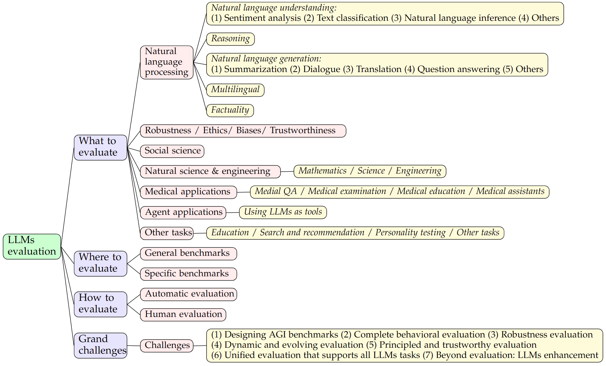

<h1 align="center">
  <br>
  
</h1>

# LLM-eval-survey
> A collection of papers and resources related to Evaluation on Large Language Model.  
> The papers are organized according to our survey: [A Survey on Evaluation of Large Language Models](https://arxiv.org/abs/2307.03109).



# Table of Contents
## What to evaluate
### Natural language processing
**Natural language understanding**  

(1) Setiment analysis:
1. Holistic evaluation of language models. _Percy Liang et al._ arXiv 2022. [[paper](https://arxiv.org/abs/2211.09110)]
2. Can chatgpt forecast stock price movements? return predictability and large language models. _Alejandro Lopez-Lira et al._ SSRN 2023. [[paper](https://papers.ssrn.com/sol3/papers.cfm?abstract_id=4412788)]
3. Is chatgpt a general-purpose natural language processing task solver? _Chengwei Qin et al._ arXiv 2023. [[paper](https://arxiv.org/abs/2302.06476)]
4. A Multitask, Multilingual, Multimodal Evaluation of ChatGPT on Reasoning, Hallucination, and Interactivity. _Yejin Bang et al._ arXiv 2023. [[paper](https://arxiv.org/abs/2302.04023)]
5. Sentiment analysis in the era of large language models: A reality check. _Wenxuan Zhang et al._ arXiv 2023. [[paper](https://arxiv.org/abs/2305.15005)]
   
(2) Text classification
1. Holistic evaluation of language models. _Percy Liang et al._ arXiv 2022. [[paper](https://arxiv.org/abs/2211.09110)]
2. Large language models can rate news outlet credibility. _Kai-Cheng Yang et al._ arXiv 2023. [[paper](https://arxiv.org/abs/2304.00228)]
3. Leveraging large language models for topic classification in the domain of public affairs. _Alejandro Peña et al._ arXiv 2023. [[paper](https://arxiv.org/abs/2306.02864)]
   
(3) Natural language inference
1. Is chatgpt a general-purpose natural language processing task solver? _Chengwei Qin et al._ arXiv 2023. [[paper](https://arxiv.org/abs/2302.06476)]
2. Can large language models infer and disagree like humans? _Noah Lee et al._ arXiv 2023. [[paper](https://arxiv.org/abs/2305.13788)]
    
(4) Others:
1. EvEval: A Comprehensive Evaluation of Event Semantics for Large Language Models. _Zhengwei Tao et al._ arXiv 2023. [[paper](https://arxiv.org/abs/2305.15268)]
2. The two word test: A semantic benchmark for large language models. _Nicholas Riccardi et al._ arXiv 2023. [[paper](https://arxiv.org/abs/2306.04610)]
3. Do LLMs Understand Social Knowledge? Evaluating the Sociability of Large Language Models with SocKET Benchmark. _Minje Choi et al._ arXiv 2023. [[paper](https://arxiv.org/abs/2305.14938)]

**Reasoning**  
1. Chatgpt is a knowledgeable but inexperienced solver: An investigation of commonsense problem in large language models. _Ning Bian et al._ arXiv 2023. [[paper](https://arxiv.org/abs/2303.16421)]
2. Is chatgpt a general-purpose natural language processing task solver? _Chengwei Qin et al._ arXiv 2023. [[paper](https://arxiv.org/abs/2302.06476)]
3. Human-like problem-solving abilities in large language models using chatgpt. _Graziella Orrù et al._ Front. Artif. Intell. 2023 [[paper](https://www.frontiersin.org/articles/10.3389/frai.2023.1199350/full)]
4. A Multitask, Multilingual, Multimodal Evaluation of ChatGPT on Reasoning, Hallucination, and Interactivity. _Yejin Bang et al._ arXiv 2023. [[paper](https://arxiv.org/abs/2302.04023)]
5. Testing the general deductive reasoning capacity of large language models using ood examples. _Abulhair Saparov et al._ arXiv 2023. [[paper](https://arxiv.org/abs/2305.15269)]
6. Chain-of-Thought Hub: A continuous effort to measure large language models’ reasoning performance. _Yao Fu et al._ arXiv 2023. [[paper](https://arxiv.org/abs/2305.17306)]
7. Can large language models reason about medical questions? _Valentin Liévin et al._ arXiv 2023. [[paper](https://arxiv.org/abs/2207.08143)]
8. Are large language models really good logical reasoners? a comprehensive evaluation from deductive, inductive and abductive views. _Fangzhi Xu et al._ arXiv 2023. [[paper](https://arxiv.org/abs/2306.09841)]
9. Evaluating the Logical Reasoning Ability of ChatGPT and GPT-4. _Hanmeng Liu et al._ arXiv 2023. [[paper](https://arxiv.org/abs/2304.03439)]

**Natural language generation**  

(1) Summarization  
1. Holistic evaluation of language models. _Percy Liang et al._ arXiv 2022. [[paper](https://arxiv.org/abs/2211.09110)]
2. A Multitask, Multilingual, Multimodal Evaluation of ChatGPT on Reasoning, Hallucination, and Interactivity. _Yejin Bang et al._ arXiv 2023. [[paper](https://arxiv.org/abs/2302.04023)]
3. Is chatgpt a general-purpose natural language processing task solver? _Chengwei Qin et al._ arXiv 2023. [[paper](https://arxiv.org/abs/2302.06476)]
4. Chatgpt vs human-authored text: Insights into controllable text summarization and sentence style transfer. _Dongqi Pu et al._ arXiv 2023. [[paper](https://arxiv.org/abs/2306.07799)]
   
(2) Dialogue
1. Is chatgpt a general-purpose natural language processing task solver? _Chengwei Qin et al._ arXiv 2023. [[paper](https://arxiv.org/abs/2302.06476)]
2. A Multitask, Multilingual, Multimodal Evaluation of ChatGPT on Reasoning, Hallucination, and Interactivity. _Yejin Bang et al._ arXiv 2023. [[paper](https://arxiv.org/abs/2302.04023)]
3. LLM-Eval: Unified Multi-Dimensional Automatic Evaluation for Open-Domain Conversations with Large Language Models. _Yen-Ting Lin et al._ arXiv 2023. [[paper](https://arxiv.org/abs/2305.13711)]
   
(3) Machine translation
1. Document-Level Machine Translation with Large Language Models. _Longyue Wang et al._ arXiv 2023. [[paper](https://arxiv.org/abs/2304.02210)]
2. A Multitask, Multilingual, Multimodal Evaluation of ChatGPT on Reasoning, Hallucination, and Interactivity. _Yejin Bang et al._ arXiv 2023. [[paper](https://arxiv.org/abs/2302.04023)]
   
(4) Question answering
1. Holistic evaluation of language models. _Percy Liang et al._ arXiv 2022. [[paper](https://arxiv.org/abs/2211.09110)]
2. Chatgpt is a knowledgeable but inexperienced solver: An investigation of commonsense problem in large language models. _Ning Bian et al._ arXiv 2023. [[paper](https://arxiv.org/abs/2303.16421)]
3. Is chatgpt a general-purpose natural language processing task solver? _Chengwei Qin et al._ arXiv 2023. [[paper](https://arxiv.org/abs/2302.06476)]
4. A Multitask, Multilingual, Multimodal Evaluation of ChatGPT on Reasoning, Hallucination, and Interactivity. _Yejin Bang et al._ arXiv 2023. [[paper](https://arxiv.org/abs/2302.04023)]
5. Benchmarking Foundation Models with Language-Model-as-an-Examiner. _Yushi Bai et al._ arXiv 2023. [[paper](https://arxiv.org/abs/2306.04181)]
   
(5) Others
1. Exploring the use of large language models for reference-free text quality evaluation: A preliminary empirical study. _Yi Chen et al._ arXiv 2023. [[paper](https://arxiv.org/abs/2304.00723)]
2. INSTRUCTEVAL: Towards Holistic Evaluation of Instruction-Tuned Large Language Models. _Yew Ken Chia et al._ arXiv 2023. [[paper](https://arxiv.org/abs/2306.04757)]
3. ChatGPT vs Human-authored Text: Insights into Controllable Text Summarization and Sentence Style Transfer. _Dongqi Pu et al._ arXiv 2023. [[paper](https://arxiv.org/abs/2306.07799)]

**Multilingual tasks**
1. Chatgpt beyond english: Towards a comprehensive evaluation of large language models in multilingual learning. _Viet Dac Lai et al._ arXiv 2023. [[paper](https://arxiv.org/abs/2304.05613)]
2.  A Multitask, Multilingual, Multimodal Evaluation of ChatGPT on Reasoning, Hallucination, and Interactivity. _Yejin Bang et al._ arXiv 2023. [[paper](https://arxiv.org/abs/2302.04023)]
3. Benchmarking arabic ai with large language models. _Ahmed Abdelali et al._ arXiv 2023. [[paper](https://arxiv.org/abs/2305.14982)]
4. M3Exam: A Multilingual, Multimodal, Multilevel Benchmark for Examining Large Language Models. _Wenxuan Zhang et al._ arXiv 2023. [[paper](https://arxiv.org/abs/2306.05179)]

**Factuality**
1. TRUE: Re-evaluating Factual Consistency Evaluation. _Or Honovich et al._ arXiv 2022. [[paper](https://arxiv.org/abs/2204.04991)]
2. Measuring and Modifying Factual Knowledge in Large Language Models. _Pouya Pezeshkpour_ arXiv 2023. [[paper](https://arxiv.org/abs/2306.06264)]
3. TrueTeacher: Learning Factual Consistency Evaluation with Large Language Models. _Zorik Gekhman et al._ arXiv 2023. [[paper](https://arxiv.org/abs/2305.11171)]
4. SelfCheckGPT: Zero-Resource Black-Box Hallucination Detection for Generative Large Language Models. _Potsawee Manakul et al._ arXiv 2023. [[paper](https://arxiv.org/abs/2303.08896)]
5. FActScore: Fine-grained Atomic Evaluation of Factual Precision in Long Form Text Generation. _Sewon Min et al._ arXiv 2023. [[paper](https://arxiv.org/abs/2305.14251)]
   
### Robustness, ethics, biases, and trustworthiness

**Robustness**
1. On Evaluating Adversarial Robustness of Large Vision-Language Models. _Yunqing Zhao et al._ arXiv 2023. [[paper](https://arxiv.org/abs/2305.16934)]
2. Generalizing to Unseen Domains: A Survey on Domain Generalization. _Jindong Wang et al._ TKDE 2022. [[paper](https://arxiv.org/abs/2103.03097)]
3. On the Robustness of ChatGPT: An Adversarial and Out-of-distribution Perspective. _Jindong Wang et al._ arXiv 2023. [[paper](https://arxiv.org/abs/2302.12095)]
4. On Evaluating Adversarial Robustness of Large Vision-Language Models. _Yunqing Zhao et al._ arXiv 2023. [[paper](https://arxiv.org/abs/2305.16934)]
5. GLUE-X: Evaluating Natural Language Understanding Models from an Out-of-distribution Generalization Perspective. _Linyi Yan et al._ arXiv 2022. [[paper](https://arxiv.org/abs/2211.08073)]
6. A Survey on Out-of-Distribution Evaluation of Neural NLP Models. _Xinzhe Li et al._ arXiv 2023. [[paper](https://arxiv.org/abs/2306.15261)]
7. PromptBench: Towards Evaluating the Robustness of Large Language Models on Adversarial Prompts. _Kaijie Zhu et al._ arXiv 2023. [[paper](https://arxiv.org/abs/2306.04528)]

**Ethic and bias**
1. RealToxicityPrompts: Evaluating Neural Toxic Degeneration in Language Models. _Samuel Gehman et al._ EMNLP 2020. [[paper](https://aclanthology.org/2020.findings-emnlp.301/)]
2. Societal Biases in Language Generation: Progress and Challenges. _Emily Sheng et al._ ACL-IJCNLP 2021. [[paper](https://aclanthology.org/2021.acl-long.330/)]
3. Exploring AI Ethics of ChatGPT: A Diagnostic Analysis. _Terry Yue Zhuo et al._ arXiv 2023. [[paper](https://arxiv.org/abs/2301.12867)]
4. BOLD: Dataset and Metrics for Measuring Biases in Open-Ended Language Generation. _Jwala Dhamala et al._ FAccT 2021 [[paper](https://dl.acm.org/doi/10.1145/3442188.3445924)]
5. BBQ: A hand-built bias benchmark for question answering. _Alicia Parrish et al._ ACL 2022. [[paper](https://aclanthology.org/2022.findings-acl.165/)]
6. Toxicity in chatgpt: Analyzing persona-assigned language models. _Ameet Deshpande et al._ arXiv 2023. [[paper](https://arxiv.org/abs/2304.05335)]
7. Should ChatGPT be Biased? Challenges and Risks of Bias in Large Language Models. _Emilio Ferrara_ arXiv 2023. [[paper](https://arxiv.org/abs/2304.03738)]
8. The Self-Perception and Political Biases of ChatGPT. _Jérôme Rutinowski et al._ arXiv 2023. [[paper](https://arxiv.org/abs/2304.07333)]
9. The political ideology of conversational AI: Converging evidence on ChatGPT's pro-environmental, left-libertarian orientation. _Jochen Hartmann et al._ arXiv 2023. [[paper](https://arxiv.org/abs/2301.01768)]
10. Moral Mimicry: Large Language Models Produce Moral Rationalizations Tailored to Political Identity. _Gabriel Simmons et al._ arXiv 2022. [[paper](https://arxiv.org/abs/2209.12106)]
11. Assessing Cross-Cultural Alignment between ChatGPT and Human Societies: An Empirical Study. _Yong Cao et al._ C3NLP@EACL 2023. [[paper](https://arxiv.org/abs/2303.17466)]

**Trustworthiness**
1. DecodingTrust: A Comprehensive Assessment of Trustworthiness in GPT Models. _Boxin Wang et al._ arXiv 2023. [[paper](https://arxiv.org/abs/2306.11698)]
2. Human-Like Intuitive Behavior and Reasoning Biases Emerged in Language Models -- and Disappeared in GPT-4. _Thilo Hagendorff et al._ arXiv 2023. [[paper](https://arxiv.org/abs/2306.07622)]
   
### Social science
1. Large language models can be used to estimate the ideologies of politicians in a zero-shot learning setting. _Patrick Y. Wu et al._ arXiv 2023. [[paper](https://arxiv.org/abs/2303.12057)]
2. Can large language models transform computational social science? _Caleb Ziems et al._ arXiv 2023. [[paper](https://arxiv.org/abs/2305.03514)]
3. How ready are pre-trained abstractive models and llms for legal case judgement summarization. _Aniket Deroy et al._ arXiv 2023. [[paper](https://arxiv.org/abs/2306.01248)]
4. Large Language Models as Tax Attorneys: A Case Study in Legal Capabilities Emergence. _John J. Nay et al._ arXiv 2023. [[paper](https://arxiv.org/abs/2306.07075)]

### Natural science and engineering

**Mathematics**
1. How well do Large Language Models perform in Arithmetic tasks? _Zheng Yuan et al._ arXiv 2023. [[paper](https://arxiv.org/abs/2304.02015)]
2. Have LLMs Advanced Enough? A Challenging Problem Solving Benchmark For Large Language Models. _Daman Arora et al._ arXiv 2023. [[paper](https://arxiv.org/abs/2305.15074)] 
3. An empirical study on challenging math problem solving with gpt-4. _Yiran Wu et al._ arXiv 2023. [[paper](https://arxiv.org/abs/2306.01337)]
4. Evaluating language models for mathematics through interactions. _Katherine M. et al._ arXiv 2023. [[paper](https://arxiv.org/abs/2306.01694)]
5. Investigating the effectiveness of chatgpt in mathematical reasoning and problem solving: Evidence from the vietnamese national high school graduation examination. _Xuan-Quy Dao et al._ arXiv 2023. [[paper](https://arxiv.org/abs/2306.06331)]
6. CMATH: Can Your Language Model Pass Chinese Elementary School Math Test? _Tianwen Wei et al._ arXiv 2023. [[paper](https://arxiv.org/abs/2306.16636)]
   
**Science**
1. Do Large Language Models Understand Chemistry? A Conversation with ChatGPT. _Castro Nascimento C M et al._ JCIM 2023. [[paper](https://pubs.acs.org/doi/10.1021/acs.jcim.3c00285)]
2. Have llms advanced enough? a challenging problem solving benchmark for large language models. _Daman Arora et al._ arXiv 2023. [[paper](https://arxiv.org/abs/2305.15074)]
   
**Engineering**
1. Is your code generated by chatgpt really correct? rigorous evaluation of large language models for code generation. _Jiawei Liu et al._ arXiv 2023. [[paper](https://arxiv.org/abs/2305.01210)]
2. Chatgpt: A study on its utility for ubiquitous software engineering tasks. _Giriprasad Sridhara et al._ arXiv 2023. [[paper](https://arxiv.org/abs/2305.16837)]
3. Large language models still can’t plan (a benchmark for llms on planning and reasoning about change). _Karthik Valmeekam et al._ arXiv 2022. [[paper](https://arxiv.org/abs/2206.10498)]
4. On the planning abilities of large language models–a critical investigation. _Karthik Valmeekam et al._ arXiv 2023. [[paper](https://arxiv.org/abs/2302.06706)]
5. Understanding the capabilities of large language models for automated planning. _Vishal Pallagani et al._ arXiv 2023. [[paper](https://arxiv.org/abs/2305.16151)]

### Medical application

**Medical QA**
1. Trialling a Large Language Model (ChatGPT) in General Practice With the Applied Knowledge Test: Observational Study Demonstrating Opportunities and Limitations in Primary Care. _Arun James Thirunavukarasu et al._ JMIR Med Educ. 2023. [[paper](https://pubmed.ncbi.nlm.nih.gov/37083633/)]
2. Analysis of large-language model versus human performance for genetics questions. _Dat Duong et al._ European Journal of Human Genetics 2023. [[paper](https://www.nature.com/articles/s41431-023-01396-8)]
3. Assessing the Accuracy of Responses by the Language Model ChatGPT to Questions Regarding Bariatric Surgery. _Jamil S. Samaan et al._ Obesity Surgery 2023. [[paper](https://link.springer.com/article/10.1007/s11695-023-06603-5)]
4. Evaluating Large Language Models on a Highly-specialized Topic, Radiation Oncology Physics. _Jason Holmes et al._ arXiv 2023. [[paper](https://arxiv.org/abs/2304.01938)]
5. Assessing the Accuracy and Reliability of AI-Generated Medical Responses: An Evaluation of the Chat-GPT Model. _Douglas Johnson et al._ Residential Square 2023. [[paper](https://pubmed.ncbi.nlm.nih.gov/36909565/)]
6. The promise and peril of using a large language model to obtain clinical information: ChatGPT performs strongly as a fertility counseling tool with limitation. _Joseph Chervenak M.D. et al._ Fertility and Sterility 2023. [[paper](https://www.sciencedirect.com/science/article/pii/S0015028223005228)]
7. Evaluation of AI Chatbots for Patient-Specific EHR Questions. _Alaleh Hamidi et al._ arXiv 2023. [[paper](https://arxiv.org/abs/2306.02549)]
8. Evaluation of ChatGPT on Biomedical Tasks: A Zero-Shot Comparison with Fine-Tuned Generative Transformers. _Israt Jahan et al._ arXiv 2023. [[paper](https://arxiv.org/abs/2306.04504)]
   
**Medical examization**
1. How Does ChatGPT Perform on the United States Medical Licensing Examination? The Implications of Large Language Models for Medical Education and Knowledge Assessment. _Aidan Gilson et al._ JMIR Med Educ. 2023. [[paper](https://www.ncbi.nlm.nih.gov/pmc/articles/PMC9947764/)]
2. Performance of ChatGPT on USMLE: Potential for AI-assisted medical education using large language models. _Tiffany H. Kung et al._ PLOS Digit Health. 2023. [[paper](https://www.ncbi.nlm.nih.gov/pmc/articles/PMC9931230/)]
   
**Medical education**
1. ChatGPT goes to the operating room: evaluating GPT-4 performance and its potential in surgical education and training in the era of large language models. _Namkee Oh et al._ Ann Surg Treat Res. 2023. [[paper](https://pubmed.ncbi.nlm.nih.gov/37179699/)]
2. Translating Radiology Reports into Plain Language using ChatGPT and GPT-4 with Prompt Learning: Promising Results, Limitations, and Potential. _Qing Lyu et al._ arXiv 2023. [[paper](https://arxiv.org/abs/2303.09038)]
   
**Medical assitants**
1. Evaluating the use of large language model in identifying top research questions in gastroenterology. _Adi Lahat et al._ Scientific reports 2023. [[paper](https://www.nature.com/articles/s41598-023-31412-2)]
2. ChatGPT: A Study on its Utility for Ubiquitous Software Engineering Task. _Giriprasad Sridhara et al._ arXiv 2023. [[paper](https://arxiv.org/abs/2305.16837)]
3. Can LLMs like GPT-4 outperform traditional AI tools in dementia diagnosis? Maybe, but not today. _Zhuo Wang et al._ arXiv 2023. [[paper](https://arxiv.org/abs/2306.01499)]
4. covLLM: Large Language Models for COVID-19 Biomedical Literature. _Yousuf A. Khan et al._ arXiv 2023. [[paper](https://arxiv.org/abs/2306.04926)]

### Agent applications
1. Language Is Not All You Need: Aligning Perception with Language Models. _Shaohan Huang et al._ arXiv 2023. [[paper](https://arxiv.org/abs/2302.14045)]
2. MRKL Systems: A modular, neuro-symbolic architecture that combines large language models, external knowledge sources and discrete reasoning. _Ehud Karpas et al._ [[paper](https://arxiv.org/abs/2205.00445)]
3. The Unsurprising Effectiveness of Pre-Trained Vision Models for Control. _Simone Parisi et al._ ICMl 2022. [[paper](https://arxiv.org/abs/2203.03580)]
4. Toolformer: Language Models Can Teach Themselves to Use Tools. _Timo Schick et al._ arXiv 2023. [[paper](https://arxiv.org/abs/2302.04761)]
5. HuggingGPT: Solving AI Tasks with ChatGPT and its Friends in Hugging Face. _Yongliang Shen et al._ arXiv 2023. [[paper](https://arxiv.org/abs/2303.17580)]

### Other applications

**Education**
1. Can Large Language Models Provide Feedback to Students? A Case Study on ChatGPT. _Wei Dai et al._ ICALT 2023. [[paper](https://edarxiv.org/hcgzj/)]
2. Can ChatGPT pass high school exams on English Language Comprehension? _Joost de Winter_ Researchgate. [[paper](https://www.researchgate.net/publication/366659237_Can_ChatGPT_pass_high_school_exams_on_English_Language_Comprehension)]
3. Is ChatGPT a Good Teacher Coach? Measuring Zero-Shot Performance For Scoring and Providing Actionable Insights on Classroom Instruction. _Rose E. Wang et al._ arXiv 2023. [[paper](https://arxiv.org/abs/2306.03090)]
4. Exploring the Responses of Large Language Models to Beginner Programmers' Help Requests. _Arto Hellas et al._ arXiv 2023. [[paper](https://arxiv.org/abs/2306.05715)]

**Search and recommendation**
1. Is ChatGPT Good at Search? Investigating Large Language Models as Re-Ranking Agent. _Weiwei Sun et al._ arXiv 2023. [[paper](https://arxiv.org/abs/2304.09542)]
2. Recommender Systems in the Era of Large Language Models (LLMs). _Wenqi Fan et al._ Researchgate. [[paper](https://www.researchgate.net/publication/372137006_Recommender_Systems_in_the_Era_of_Large_Language_Models_LLMs)]
3. Is ChatGPT Fair for Recommendation? Evaluating Fairness in Large Language Model Recommendation. _Jizhi Zhang et al._ arXiv 2023. [[paper](https://arxiv.org/abs/2305.07609)]
4. ChatGPT vs. Google: A Comparative Study of Search Performance and User Experience. _Ruiyun Xu et al._ arXiv 2023. [[paper](https://arxiv.org/abs/2307.01135)]

**Personality testing**
1. Have Large Language Models Developed a Personality?: Applicability of Self-Assessment Tests in Measuring Personality in LLMs. _Xiaoyang Song et al._ arXiv 2023. [[paper](https://arxiv.org/abs/2305.14693)]
2. ChatGPT is fun, but it is not funny! Humor is still challenging Large Language Models. _Sophie Jentzsch et al._ arXiv 2023. [[paper](https://arxiv.org/abs/2306.04563)]
3. Personality Traits in Large Language Models. _Mustafa Safdari et al._ arXiv 2023. [[paper](https://arxiv.org/abs/2307.00184)]

**Other tasks**
1. ChatGPT and Other Large Language Models as Evolutionary Engines for Online Interactive Collaborative Game Design. _Pier Luca Lanzi et al._ arXiv 2023. [[paper](https://arxiv.org/abs/2303.02155)]
2. PandaLM: An Automatic Evaluation Benchmark for LLM Instruction Tuning Optimization. _Yidong Wang et al._ arXiv 2023. [[paper](https://arxiv.org/abs/2306.05087)]
3. An Evaluation of Log Parsing with ChatGPT. _Van-Hoang Le et al._ arXiv 2023. [[paper](https://arxiv.org/abs/2306.01590)]

## Where to evaluate
The paper lists 13 popular benchmarks. For better summarization, these benchmarks are divided into two categories: general language task benchmarks and specific downstream task benchmarks.
| Benchmark   | Focus                              | Domain                   | Evaluation Criteria                           |
|-------------|------------------------------------|--------------------------|-----------------------------------------------|
| AlpacaEval[[GitHub](https://github.com/tatsu-lab/alpaca_eval)]  | Automated Evaluation               | General language task    | Metrics, Robustness, Diversity                |
| AGIEval[[paper](https://arxiv.org/abs/2304.06364)]     | Human-centered Foundational Models | General language task    | General                                       |
| GLUE-X [[paper](https://arxiv.org/abs/2211.08073)] [[GitHub](https://github.com/YangLinyi/GLUE-X)]     | Natural Language Understanding     | General language task    | Metrics, OOD Robustness                       |
| KoLA [[papeer](https://arxiv.org/abs/2306.09296)]       | Knowledge-Oriented Evaluation      | General language task    | Overall standard scores, Self-contrast metric |
| DynaBench [[paper](https://arxiv.org/abs/2104.14337)]   | Dynamic Evaluation                 | General language task    | NLI, QA, Sentiment, Hate speech               |
| PromptBench [[paper](https://arxiv.org/abs/2306.04528)] [[GitHub](https://github.com/microsoft/promptbench)] | Adversarial Prompt Resilience      | General language task    | Prompt Design, Robustness                     |
| PandaLM [[paper](https://arxiv.org/abs/2306.05087)] [[GitHub](https://github.com/WeOpenML/PandaLM)]     | Automatic Evaluation               | General language task    | Model Performance Reliability                 |
| HELM [[paper](https://arxiv.org/abs/2211.09110)]        | Comprehensive Evaluation           | General language task    | Task-Specific Metrics                         |
| Big-Bench [[paper](https://arxiv.org/abs/2206.04615)][[GitHub](https://github.com/google/BIG-bench)]    | Language Model Evaluation          | Specific downstream task | Various Metrics, Model Comparisons            |
| C-Eval [[paper](https://arxiv.org/abs/2305.08322)][[GitHub](https://github.com/SJTU-LIT/ceval)]      | Chinese Evaluation                 | Specific downstream task | Advanced knowledge, Reasoning abilities       |
| Leaderboard [[Link](https://huggingface.co/spaces/HuggingFaceH4/open_llm_leaderboard)] | Language Model Evaluation          | Specific downstream task | Task-Specific Metrics, Leaderboard Rankings   |
| M3Exam [[paper](https://arxiv.org/abs/2306.05179)] [[GitHub](https://github.com/DAMO-NLP-SG/M3Exam)]     | Multilingual Multimodal Multilevel | Specific downstream task | Task-Specific Metrics                         |
| MultiMedQA  | Medical Question Answering         | Specific downstream task | Accuracy, Medical Knowledge, Reasoning        |
| SOCKET      | Sociability                        | Specific downstream task | Coherence, Contextual Understanding           |
| API-Bank    | Tool-augmented                     | Specific downstream task | Metrics                                       |
| ToolBench   | Software tools                     | Specific downstream task | Execution success rate                        |

## How to evaluate
### Automatic evaluation
### Human evaluation

## Contributors

```plaintext
Yupeng Chang, Xu Wang, Jindong Wang, Yuan Wu, Kaijie Zhu, Hao Chen, Linyi Yang, Xiaoyuan Yi, Cunxiang Wang, Yidong Wang, Wei Ye, Yue Zhang, Yi Chang, Philip S. Yu, Qiang Yang, and Xing Xie, "A Survey on Evaluation of Large Language Models," arXiv preprint arXiv:2307.03109, 2023.
```
We welcome contributions to this project. If you have any ideas, issues, please feel free to submit a pull request or open an issue. Your contributions are greatly appreciated!


## Citation

If you find this project useful in your research or work, please consider citing it:

```plaintext
@misc{chang2023survey,
      title={A Survey on Evaluation of Large Language Models}, 
      author={Yupeng Chang and Xu Wang and Jindong Wang and Yuan Wu and Kaijie Zhu and Hao Chen and Linyi Yang and Xiaoyuan Yi and Cunxiang Wang and Yidong Wang and Wei Ye and Yue Zhang and Yi Chang and Philip S. Yu and Qiang Yang and Xing Xie},
      year={2023},
      eprint={2307.03109},
      archivePrefix={arXiv},
      primaryClass={cs.CL}
}
```
